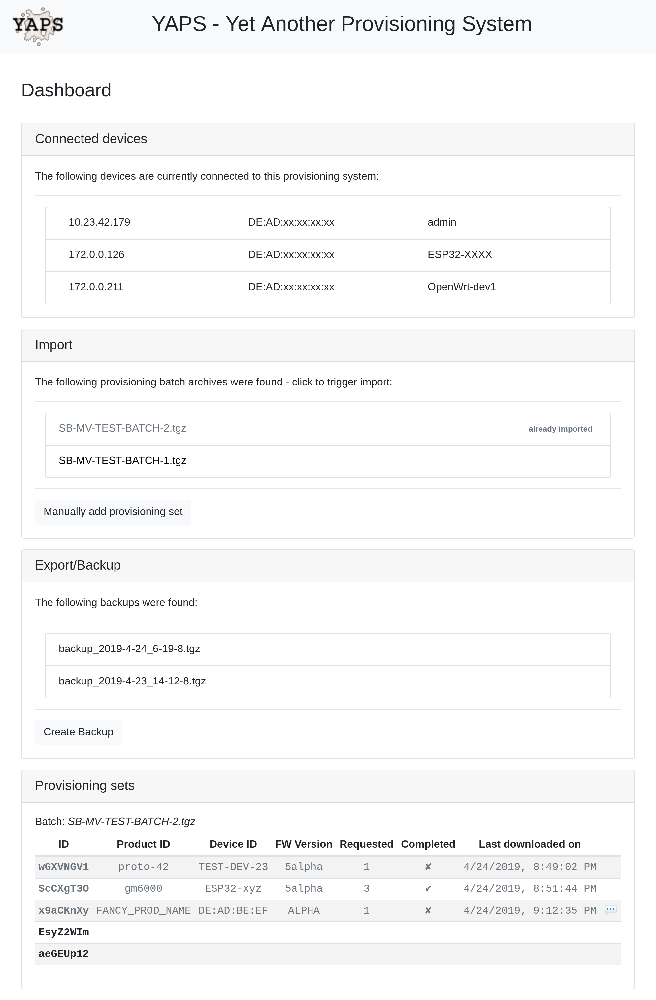

# YAPS - Yet Another Provisioning System

## Introduction

YAPS was designed to incoroprate all kinds of major buzzwords in its README:

 - flexible (data columns are created dynamically and content is treated as raw bytes)
 - secure (tried to make it as hard as possible to screw up the system, by implementing consistency checks everywhere and calling them every time)
 - fast (probably it's not, but state it nevertheless)
 - lightweight (at least on server/python side: plain python3/CGI code, no dependencies to external packages)
 - simple, low-overhead HTTP API for clients/devices to fetch endpoint information
 - minimalistic and intuitive management interface (powered by bloated and default bootstrap theme)
 - runs on OpenWrt
 - blockchain / AI


## Purpose

YAPS is a provisioning system supposed to maintain project/infrastructure (=static) data as well as client/device specific (=dynamic) data and provide it to e.g. clients (e.g. embedded devices) via a simple API.

Infrastructure/Project specific (=static) data could be e.g. endpoints for:
 - MQTT broker (host, port, CA certificate, etc.)
 - OTA update server (URL, public key for signature verification, etc.)
 - RTP server

While client specific (=dynamic) data could be e.g.:
 - Unique ID to be associated with device
 - Usernames / Passwords
 - x509 client certificates
 - cryptographically secure random data, e.g. used as pre-seed for rather insecure PRNGs on clients


## Management web interface

The management web interface allows initialization, importing, exporting and monitoring, as well as manual import of certificates not part of a batch, disassociation of sets from devices and manual (re)assignments.

The web interface is not needed for the actual process of provision client (as long as provisioning sets are available to be (re)assigned).

More features to come..



## General idea / Setup guidelines / Hints

An idea is that the hardware running YAPS is a small embedded device, featuring USB ports and - depending on the type of to be provisioned client devices - ethernet.

That's where the "runs on OpenWrt"-feature originates from - a cheap WiFi-router (with disabled WiFi) works perfectly fine as underlying hardware.

As quite some IoT devices don't feature ethernet connectivity anymore (but only WiFi - and WiFi is a notoriously bad idea to use for transporting initial, precious and confidential provisioning information to a device) I came up with using PPPoS (PPP over Serial/UART).

In practice that means, that I provision my ESP8266 development board via YAPS over HTTP over IP over UART over USB. Well, it does the job.

Following up on the general idea, the actual provisioning data is stored on external media, let's say USB thumb drives - not on the system running YAPS itself.

Each such drive is dedicated to a particular infrastructure/project.

That way, depending for which infrastructure/project you'd want to provision clients, you'd just insert/swap respective drives.

Also batches of (additional) provisioning sets should be stored and imported via external media, dedicated for the sole purpose of importing batches.
Same goes for backups.


## Installation

Simply clone respective repository, `npm install` frontend dependencies and start / tell your webserver about the document root and cgi-bin directory.

For *uhttpd* - the default webserver used by OpenWrt - a command line would look like this:
`uhttpd -f -p 0.0.0.0:8080 -h /yaps.git -r YAPS -x /cgi -t 60 -T 30 -k 20 -A 1 -n 1 -N 10 -R`

Change the `PREFIX` variable inside `cgi/provsys.py` accordingly.
A file structure alike is anticipated:
```
$PREFIX/PROV
$PREFIX/IMPORT
$PREFIX/EXPORT
```
where `PROV`, `IMPORT`, `EXPORT` are directories recommended to be mount-points -- see "General idea / Setup guidelines / Hints" for further info on this.


## Starting with an endpoints config file

Base of YAPS is a static, infrastructure/project specific `endpoints.json`-file, from which the environment will be initialized (and pinned to).

That file is also going to be transferred to and used by the client so it's aware of the structure, hence, being able to make the respective API calls to retrieve provisioning information.
Also it could/should be also used by whatever software is running on the client to retrieve stored connection endpoint information.

Such an `endpoints.json`-file could look like:
```
{
  "version": 1,
  "project": "MV-TEST",
  "endpoints": {
    "wifi": {
      "ssid": "WIFI-SSID",
      "pass": "WIFI-PASSWORD"
    },
    "ota": {
      "url": "https://ota.xyz.projects.nanl.de:4443",
      "files": [
        {"name": "ca.crt",  "type": "static"},
        {"name": "sig.pub", "type": "static"}
      ]
    },
    "mqtt": {
      "files": [
        {"name": "ca.crt", "type": "static"},
        {"name": "key",    "type": "dynamic"},
        {"name": "crt",    "type": "dynamic"}
      ],
      "host": "mqtt.xyz.projects.nanl.de",
      "port": 8883
    },
    "rtp": {
      "host": "rtp.xyz.projects.nanl.de"
    },
    "random": {
      "files": [
        {"type": "dynamic"}, // omitting 'name'-attr as there's only one file of this type
      ]
    }
  }
}
```

Files listed in `endpoints.*.files` can be eventually requested via the `getEndpointsFile` API call (see HTTP API description).


## Import format

Data can be imported via properly formatted tar({.gz,bz2})-archives, following a file structure, probably also illustrated best by an example matching above `endpoints.json` structure:
```
./endpoints.json
./secret
./ota.ca.crt
./ota.sig.sub
./mqtt.ca.crt
./sets
./sets/AAAA
./sets/AAAA/mqtt.crt
./sets/AAAA/mqtt.key
./sets/AAAA/random
./sets/BBBB
./sets/BBBB/mqtt.crt
./sets/BBBB/mqtt.key
./sets/BBBB/random
./sets/CCCC
./sets/CCCC/mqtt.crt
./sets/CCCC/mqtt.key
./sets/CCCC/random
```
<sub>***Static** file `secret` is (supposed to be) infrastructure/project specific cryptographically secure random data **not** to be transferred to any client, therewith representing an exception, as it is part of a hardcoded list of files, which can't be retrieved by the `getEndpointsFile` API call.
Instead YAPS provides a special API call named `getHash`, which returns a sha256 hash over `$static_secret` and `$client_id`.
That way the client can ensure it's connected to the exact provisioning infrastructure it was initially provisioned with and only then allow particular alterations (e.g. deprovisioning).
This file is also used to distinguish infrastructures*</sub>

(Additional) sets of dynamic files can be imported on demand, however once the system was initialized via its very first import, further import archives must provide the same static data (`secret` and `endpoints.json` to be precise).
This is to ensure consistency, so projects/infrastructures don't get mixed up.

## HTTP API description

All HTTP API calls *must* provide the following CGI arguments:
 - `prod_id`
 - `fw_ver`
 - `dev_id`

HTTP API:
 - `check`
   - Desc: Check connection and if there's a free/unassigned or with client's `dev_id` associated set
 - `getConfig`
   - Desc: Fetch `endpoints.json` config file
 - `getHash`
   - Desc: Fetch a hash created over `secret` and `dev_id` which could be stored on the client in order to identify/verify the provisioning infrastructure at a later state
 - `getEndpointsFile`
   - Desc: Fetch endpoint file (dynamic or static)
   - Argument: `file` (filename prefixed with type)
     - E.g.: `static/mqtt.ca.crt`, `dynamic/mqtt.crt`, `dynamic/random`
 - `setDone`
   - Desc: Let the YAPS system know the client considers itself being successfully provisioned

Full example, given YAPS is initialized with a configuration similar to above:
 1. `http://host/cgi/prov/check?prod_id=FANCY_PROD_NAME&fw_ver=ALPHA&dev_id=DE:AD:BE:EF`
 2. `http://host/cgi/prov/getConfig?prod_id=FANCY_PROD_NAME&fw_ver=ALPHA&dev_id=DE:AD:BE:EF`
 3. `http://host/cgi/prov/getEndpointsFile?file=dynamic/random&prod_id=FANCY_PROD_NAME&fw_ver=ALPHA&dev_id=DE:AD:BE:EF`
 4. `http://host/cgi/prov/setDone&prod_id=FANCY_PROD_NAME&fw_ver=ALPHA&dev_id=DE:AD:BE:EF`


## FAQ

Actually nobody raised those questions as this FAQ is part of the very first commit in this repository, but I'm happy to answer them anyway:

 - Your HTML/JavaScript code is awful, that's not how you do things, especially not in 2019!
   - That's not even a question! But you're right. I'm not a frontend developer and after having read [this](https://hackernoon.com/how-it-feels-to-learn-javascript-in-2016-d3a717dd577f) I don't intend to become one (and the article is from 2016!).
   Contributions of any kind are highly appreciated though!

 - The web interface looks shit, it's all black/white/grey - are you color blind?!
   - Yes.


## Credits

This work was in parts sponsored and/or supported by:
 - [Gesellschaft für sichere mobile Kommunikation (GSMK) mbH (gsmk.de)](http://gsmk.de)
 - [Sensorberg GmbH (sensorberg.com)](http://sensorberg.com)
 - [Flatbox (flatbox.co)](http://flatbox.co)

Thank you so much! I mean it!
